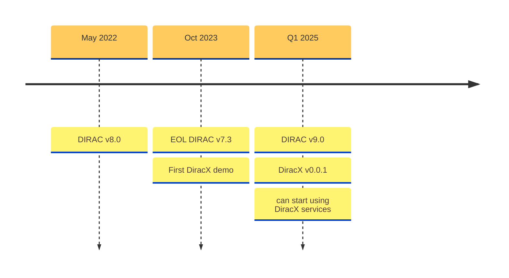

# Testing Dirac

**Federico Stagni** <Email v="federico.stagni@cern.ch" />

January 16th 2025
__ <a href="https://indico.cern.ch/event/1443765" class="ns-c-iconlink"><mdi-open-in-new />Dirac & Rucio mini-workshop and hackathon</a>  


---
layout: section 
color: lime-light
---

<div style="display: flex; align-items: center; justify-content: center;">
    
    <span style="margin: 0 50px;">--></span>
    
</div>


<StickyNote color="gray-light" textAlign="center" width="260px" title="Developers and maintainers requirements" v-drag="[350,300,320,100]">
Easy to test (will make it easier to code), but also modern, fun, and accessible to new developers
</StickyNote>

<!-- 
This is not the first time that we rewrite DIRAC, but this time it is more profound, and to enforce this we decided to slightly change the name, adding a "fashionable" X at the end, and using a slightly different color scheme for the logo
-->

---
layout: top-title
color: gray-light
align: c
title: Versions
---

:: title ::

# Versions

:: content ::



<SpeechBubble position="r" color='cyan' shape="round"  v-drag="[20,211,148,240]">
Current production and only supported version, used by all DIRAC installations
</SpeechBubble>


<SpeechBubble position="l" color='amber' shape="round"  v-drag="[780,265,140,175]">
DIRAC v9 and DiracX 0.0.1 will be released together.
</SpeechBubble>


---
layout: top-title
color: gray-light
align: c
title: CLI
---

:: title ::

# CLI Interactions

:: content ::

**Run the demo (on your laptop):**

```sh
git clone https://github.com/DIRACGrid/diracx-charts
diracx-charts/run_demo.sh # this is run for each and every commit in Github Actions
```

---
layout: section
color: cyan-light
title: Conclusions
---

# To conclude

---
layout: top-title-two-cols
align: cm-cm-lm
color: orange-light
columns: is-4
title: summary
--- 
:: title ::

# Summary

:: left :: 


---
layout: credits
color: navy
loop: true
speed: 1.0
title: credits/people
---

<div class="grid-item col-span-3 text-center mt-180px mb-auto font-size-1.5rem">
    <strong>Questions?</strong>
</div>

---
layout: section
color: cyan-light
title: Backup
---

# Backup
