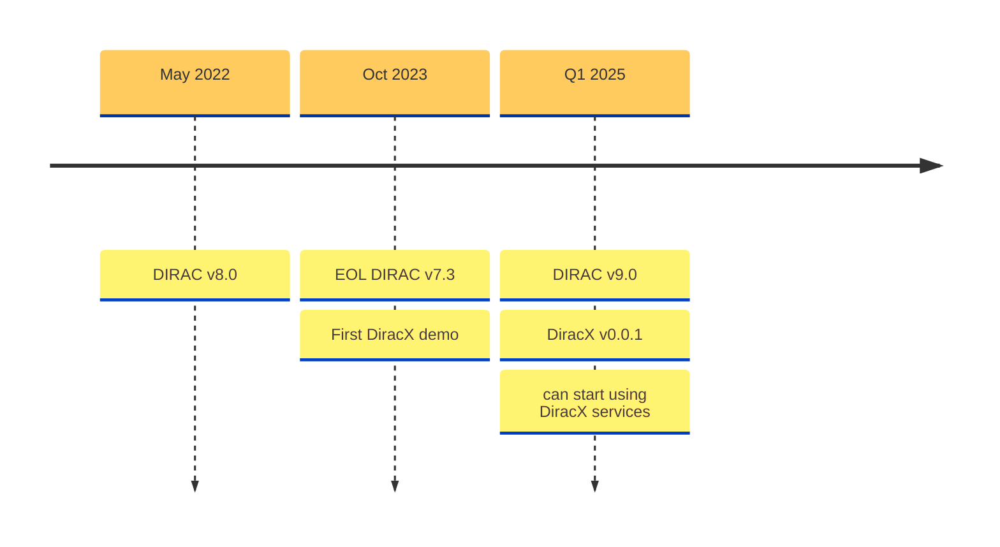
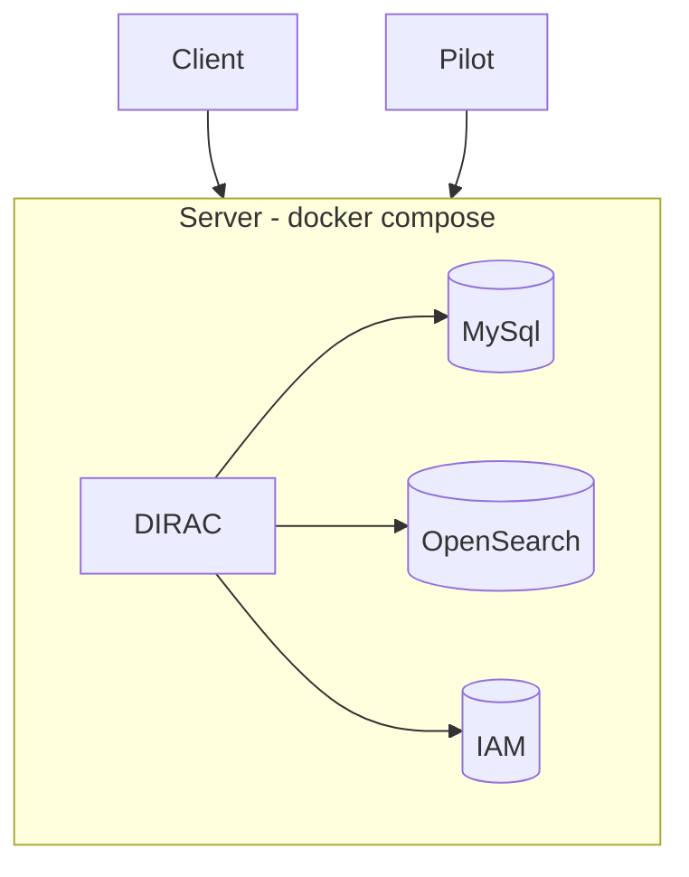
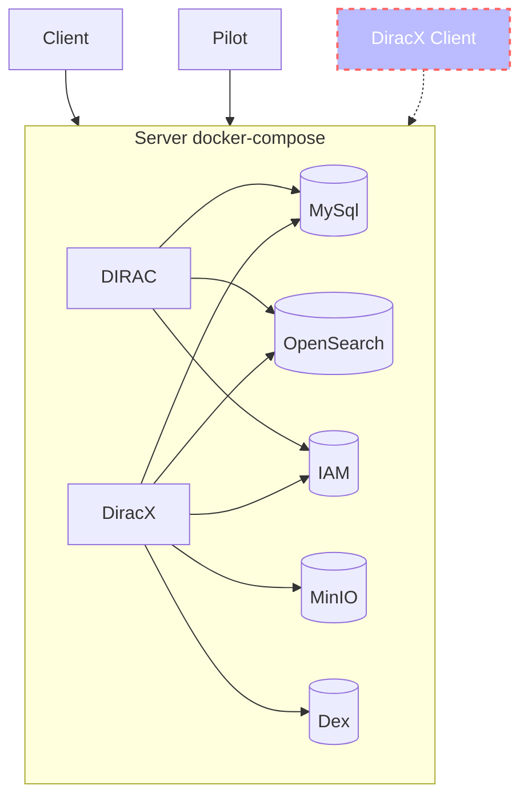
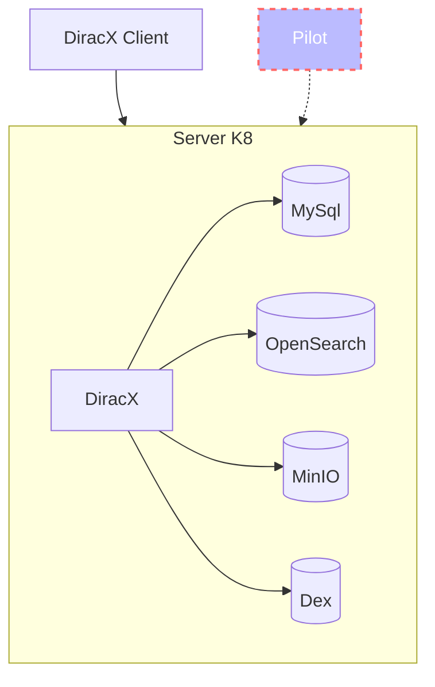
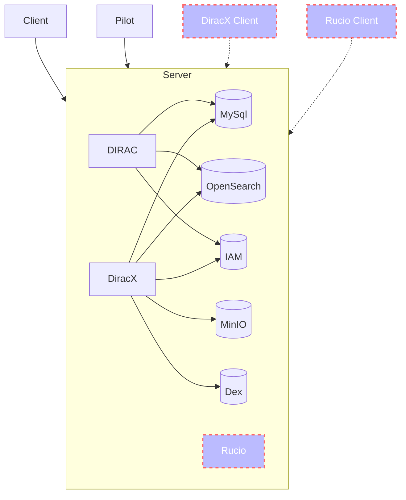

# Testing Dirac

**Federico Stagni** <Email v="federico.stagni@cern.ch" />

January 16th 2025
__ <a href="https://indico.cern.ch/event/1443765" class="ns-c-iconlink"><mdi-open-in-new />Dirac & Rucio mini-workshop and hackathon</a>  


---
layout: section 
color: lime-light
---

<div style="display: flex; align-items: center; justify-content: center;">
    
    <span style="margin: 0 50px;">--></span>
    
</div>


<StickyNote color="orange-light" textAlign="center" width="260px" title="Developers and maintainers requirements" v-drag="[350,400,320,100]">
Easy to test (will make it easier to code) ...
</StickyNote>

<AdmonitionType type='Note' >
This presentation is about "integration" and "system" tests, not about "unit" tests (which are developers' responsibility)
</AdmonitionType>


---
layout: top-title
color: gray-light
align: c
title: Versions
---

:: title ::

# Versions

:: content ::



<SpeechBubble position="r" color='cyan' shape="round"  v-drag="[20,211,148,240]">
Current production and only supported version, used by all DIRAC installations
</SpeechBubble>


<SpeechBubble position="l" color='amber' shape="round"  v-drag="[780,265,140,175]">
DIRAC v9 and DiracX 0.0.1 will be released together.
</SpeechBubble>

---
layout: section
color: cyan-light
title: integration tests
---

# Integration tests


---
layout: top-title-two-cols
color: gray-light
align: c-lm-lm
title: v8
---

:: title ::

# DIRAC v8

:: left ::




:: right ::

<AdmonitionType type='Note' >
The Pilot is "yet another client", but "special"
</AdmonitionType>


- based on docker compose (link to [file](https://github.com/DIRACGrid/DIRAC/blob/integration/tests/CI/docker-compose.yml))
- tests on different mysql and elastic/opensearch and IAM versions
- the system creates a "fake" CA, and certificates
- "server", "client" and "pilot"


---
layout: top-title-two-cols
color: gray-light
align: c-lm-lm
title: v9
---

:: title ::

# DIRAC v9+DiracXv0.0.1

:: left ::



:: right ::

- DiracX server is only running `uvicorn`, all DBs are from the docker-compose setup
- Effectively, as of now there's no running legacy adaptor
- The tests specific for DiracX code are run in the DiracX repo

---
layout: iframe-right
url: https://github.com/DIRACGrid/DIRAC/actions/workflows/integration.yml
color: gray-light
align: lm
title: how
---

# How to do this locally

For getting the environment

```sh
git clone git@github.com:DIRACGrid/DIRAC.git
cd DIRAC
mamba create --name my-dirac-env -c conda-forge dirac-grid
conda activate my-dirac-env
pip install -e .
```

Know your options with:

```sh
./integration_tests.py --help 
# "./integration_tests.py create" does the whole stuff
```


---
layout: top-title-two-cols
color: gray-light
align: c-lm-lm
title: DiracX
---

:: title ::

# DiracX only

:: left ::



:: right ::


**Notes**:
- Based on [kind](https://kind.sigs.k8s.io/)
  - runs the same helm charts used for actual servers
- Uses mysql and opensearch
  - attempt to use PostgreSQL failed because of "date format" issues
- Run at every commit in GA

---
layout: top-title
color: gray-light
align: c
title: DiracX-how
---

:: title ::

# In DiracX

:: content ::

Run a local `uvicorn` server with default configuration:

```sh
git clone https://github.com/DIRACGrid/diracx
cd diracx
mamba create --name my-diracx-env
conda activate my-diracx-env
pip install requirements-dev.txt
./run_local.sh
```

SQL DBs are in `SQLite` (no similar option for OpenSearch, so still using sqlite).

&nbsp;
&nbsp;

**Run the demo**

```sh
git clone https://github.com/DIRACGrid/diracx-charts
./diracx-charts/run_demo.sh # this is run for each and every commit in Github Actions
pytest --demo-dir=../diracx-charts/
```


---
layout: top-title
color: gray-light
align: c
title: withRucio
---

:: title ::

# With Rucio?

:: content ::




<SpeechBubble position="l" color='amber' shape="round"  v-drag="[700,200,140,145]">
A hackathon topic?
</SpeechBubble>

<SpeechBubble position="t" color='amber' shape="round"  v-drag="[750,365,180,145]">
Something from https://github.com/maxnoe/rucio-dirac-dev ?
</SpeechBubble>


---
layout: section
color: cyan-light
title: integration tests
---

# Integration tests

---
layout: top-title
color: gray-light
align: c
title: system
---

:: title ::

# AKA adventures in the real world

:: content ::

Integration tests are for testing the "Grid in box", but for interacting with Grid resources we have a "real" Grid Setup:
- sends "real" pilots and jobs, manages "real" data, uses "real" FTS, "real" IAM, ...
- uses the `dteam` and `gridpp` VOs
- we run "hackathons" there regularly (with boards from [github projects](https://github.com/orgs/DIRACGrid/projects))
- `DiracX` is hosted on `paas.cern.ch` (OpenShift)
- also for testing the WebApp(s)
- very useful, but needs maintenance
- all VOs have similar test setups


---
layout: top-title
color: gray-light
align: c
title: SystemWithRucio
---

:: title ::

# System tests, but with Rucio?

:: content ::

Adventures in the real world, but **with Rucio**?

<SpeechBubble position="l" color='amber' shape="round"  v-drag="[580,100,170,125]">
A hackathon topic?
</SpeechBubble>

<SpeechBubble position="t" color='amber' shape="round"  v-drag="[580,265,240,125]">
Sort of a "demostrator"...
</SpeechBubble>


---
layout: section
color: cyan-light
title: Conclusions
---

# To conclude

---
layout: top-title
align: c
color: orange-light
title: summary
--- 
:: title ::

# Summary

:: content :: 

- We can have Dirac+Rucio testing playground
- I would keep it separate from both
- Should be maintained by interested parties


---
layout: credits
color: navy
loop: true
speed: 1.0
title: credits/people
---

<div class="grid-item col-span-3 text-center mt-180px mb-auto font-size-1.5rem">
    <strong>Questions?</strong>
</div>

---
layout: section
color: cyan-light
title: Backup
---

# Backup

---
layout: top-title
color: gray-light
align: c
title: Pilot
---

:: title ::

# Pilot tests

:: content ::

For testing different pilot configurations. Connect to the certification setup
